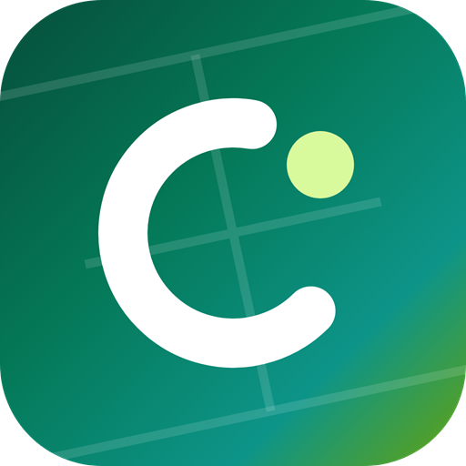

# Clubnetz

[English](README.md) · **Deutsch**

**Open-Source-Vereinsverwaltung und Platzbuchung für Tennisvereine.**

Mitglieder buchen Plätze in Sekunden. Der Vorstand verwaltet Mitglieder, Saisonen, Gäste, Termine und Neuigkeiten an einem Ort. 
Kostenlos, selbst hostbar, auf jedem Handy installierbar, auf Deutsch und Englisch.

**Bereits gehostet und für Vereine kostenlos auf [clubnetz.app](https://clubnetz.app/de/)**

---

## 🎾 Was ist Clubnetz?

Clubnetz ist eine kostenlose Open-Source-Web-App für Tennisvereine und für jeden anderen Sportverein, der Plätze zu vergeben hat. Entstanden ist sie als Platzbuchung für einen Tennisverein. Inzwischen ist daraus eine vollständige Vereinsverwaltung geworden: Platzreservierung, Mitglieder, Gäste, Vereinskalender, Neuigkeiten, Statistiken und ein wenig freundschaftlicher Wettbewerb.

Es gibt zwei Wege, Clubnetz zu nutzen:

- **Die gehostete Version.** Clubnetz läuft bereits auf **[clubnetz.app](https://clubnetz.app/de/)**, kostenlos für Vereine und Mitglieder. Schreibt an [hello@clubnetz.app](mailto:hello@clubnetz.app), und euer Verein bekommt einen eigenen Bereich. Ihr müsst nichts installieren und nichts warten.
- **Selbst hosten** mit Docker ([Anleitung auf Englisch](README.md#-hosting-it-yourself)).

Der Quellcode steht unter der Lizenz AGPL-3.0.

Eine Installation bedient viele Vereine. Jeder Verein ist ein eigener Mandant mit eigenen Plätzen, Saisonen, Mitgliedern, Rollen und E-Mail-Texten.

## ✨ Funktionen

### Für Mitglieder

| | |
|---|---|
| 🎾 **Platzbuchung** | Mit wenigen Klicks einen Platz buchen, mit Spielarten, Öffnungszeiten, Prime-Time-Regeln und Kontingenten je Saison. |
| 🔁 **Serienbuchungen** | Denselben Termin jede Woche oder alle paar Wochen reservieren. Einen einzelnen Termin oder diesen und alle folgenden ändern oder absagen. |
| 👨‍👩‍👧 **Familien** | Eltern buchen und verwalten für ihre Kinder. |
| 📅 **Vereinskalender** | Arbeitseinsätze, Feste, Turniere und Sitzungen, mit Anmeldung, Personenzahl und den Fragen der Organisatoren („2x Schnitzel, bitte“). Termine per Link oder WhatsApp teilen. |
| 📰 **Vereinsneuigkeiten** | Ankündigungen mit Anhängen, angepinnten Beiträgen und Ablaufdatum. |
| 📊 **Statistiken und Ranglisten** | Wer spielt am meisten, mit wem und wann. |
| 🏆 **Abzeichen und Trophäenschrank** | Abzeichen, die man sich über die Saison erspielt, und einmalige Abzeichen für besondere Erfolge. |
| 🗓️ **Abo-Planer** | Erstellt einen fairen Spielplan für gemeinsame Winterabos und exportiert ihn nach Excel. |
| 🔔 **Benachrichtigungen** | Neue oder abgesagte Buchung, Erinnerung vor dem Spiel, neue Termine, Neuigkeiten und Abzeichen. Per Push, per E-Mail oder gar nicht. |
| 📱 **Installierbare App** | Auf iOS, Android und am Computer auf den Startbildschirm legen. Mit hellem und dunklem Design. |

### Für den Vorstand

| | |
|---|---|
| 👥 **Mitglieder und Saisonen** | Mitglieder, Rollen (Admin, Sportwart, Kassier, Trainer, …) und die Anmeldung je Saison. |
| 🎟️ **Gästekarten** | Gäste buchen mit einem Link oder Code und einer festen Anzahl an Buchungen. |
| 🏟️ **Plätze und Spielarten** | Plätze, Öffnungszeiten, Prime Time, Buchungsregeln und wer was buchen darf. |
| 🚧 **Platzsperren** | Plätze für Turniere, Wartung, Wetter oder das wöchentliche Training sperren. Betroffene Spieler werden informiert. |
| ✉️ **E-Mail-Vorlagen** | Jede Vereins-E-Mail je Sprache anpassen, mit Markdown und Variablen, Live-Vorschau und Testversand. |
| 📣 **Aussendungen per E-Mail** | Neuigkeiten an alle Mitglieder, die aktive Saison, die Jugend oder einzelne Rollen senden. |
| 📈 **Vereinsstatistik** | Auslastung der Plätze und Aktivität über die Saison. |

### Immer dabei

- **Mandantenfähig** – die Daten jedes Vereins sind von denen der anderen getrennt.
- **Deutsch und Englisch** – jede Seite, jede E-Mail und jede Benachrichtigung.
- **Datenschutz** – Mitglieder können ihre Daten selbst exportieren, einen Verein verlassen und ihr Konto löschen. Impressum und Datenschutzerklärung sind enthalten.
- **Abgesichert** – Kontosperre nach Fehlversuchen, Rate Limiting, strenge Content Security Policy und Security-Header.

## 🛠️ Für Entwicklerinnen und Entwickler

Technik, lokale Einrichtung, Hosting mit Docker, Projektstruktur und die Hinweise zum Mitmachen stehen in der [englischen README](README.md):

- [Tech stack](README.md#-tech-stack)
- [Getting started](README.md#-getting-started)
- [Hosting it yourself](README.md#-hosting-it-yourself)
- [Project structure](README.md#-project-structure)
- [Contributing](README.md#-contributing)

Fehler und Ideen könnt ihr auch auf Deutsch als [Issue](https://github.com/sleepwalkerffs/Clubnetz/issues/new/choose) melden.

## 📄 Lizenz

Clubnetz ist freie Software unter der [GNU Affero General Public License v3.0](LICENSE).

Kurz gesagt: Ihr dürft Clubnetz nutzen, verändern und hosten, auch kommerziell. Wenn ihr es weitergebt oder eine veränderte Version über ein Netzwerk anbietet, müsst ihr den Quellcode eurer Version unter derselben Lizenz zugänglich machen.

---

Mit 🎾 gemacht für Vereine, die lieber spielen als Papierkram erledigen.

